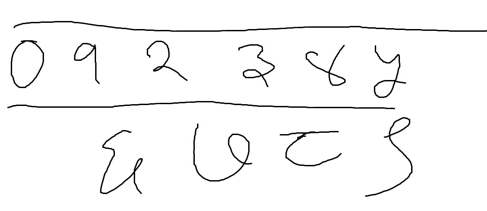

# ankaAnumaan (Nepali Digit Recognition)

## About

> A simple neural network using Tensorflow that recognizes Nepali hand written digits.
>
> The entire project - from collected raw data to cleaned training data and usable neural network is available in this repo. I've also included a few neural network models including a few CNNs (Hence, the large download size.) so that you can compare the accuracy and prediction time of these neural networks.
>
> Feel free to ask questions.

## To try it yourself

### **Clone the repo to your desired directory**

    git clone https://github.com/SafalPandey/ankaAnumaan.git

### **Navigate to the directory**

    cd ankaAnumaan

### **Install requirements**

    pip install -r requirements.txt

_You need to have pip installed for this to work._

### **Run the program on an image**

    python ankaAnumaan.py 0to9.jpg

> This takes the image file: **0to9.jpg** inside **input/** folder and runs it through the selected neural network model (Hardcoded in **ankaAnumaan.py** file.) and gives a labelled image to **output/** folder.  
>You can use any one of the images inside **input/** folder or specify the absolute path (from root) to the image you wish to classify.  
>_Please note that only images with high contrast are contoured and then classified accurately._
> **Enjoy :D**

#### Input image
> 
#### Output image
> 

